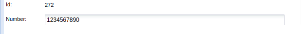
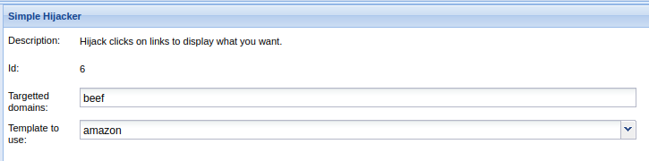

# Table of Contents

- [Table of Contents](#table-of-contents)
  - [Browser](#browser)
    - [Apache Tomcat RequestHeaderExample Cookie Disclosure](#apache-tomcat-requestheaderexample-cookie-disclosure)
    - [Detect Foxit Reader](#detect-foxit-reader)
    - [Detect LastPass](#detect-lastpass)
    - [Detect MIME Types](#detect-mime-types)
    - [Detect QuickTime](#detect-quicktime)
    - [Detect RealPlayer](#detect-realplayer)
    - [Detect Silverlight](#detect-silverlight)
    - [Detect Toolbars](#detect-toolbars)
    - [Detect Unity Web Player](#detect-unity-web-player)
    - [Detect Windows Media Player](#detect-windows-media-player)
    - [Fingerprint Browser](#fingerprint-browser)
    - [Get Cookie](#get-cookie)
    - [Get Form Values](#get-form-values)
    - [Get Page HREFs](#get-page-hrefs)
    - [Get Page HTML](#get-page-html)
    - [Get Page and iframe HTML](#get-page-and-iframe-html)
    - [Link Rewrite](#link-rewrite)
    - [Link Rewrite (Click Events)](#link-rewrite-click-events)
    - [Link Rewrite (HTTPS)](#link-rewrite-https)
    - [Link Rewrite (TEL)](#link-rewrite-tel)
    - [Play Sound](#play-sound)
    - [Remove Hook Element](#remove-hook-element)
    - [Remove stuck iframe](#remove-stuck-iframe)
    - [Unhook](#unhook)
    - [Webcam (Flash)](#webcam-flash)
    - [Webcam Permission Check](#webcam-permission-check)
    - [Detect Evernote Web Clipper](#detect-evernote-web-clipper)
    - [Detect VLC](#detect-vlc)
    - [Fingerprint Ajax](#fingerprint-ajax)
    - [Get Visited Domains](#get-visited-domains)
    - [Get Visited URLs (Avant Browser)](#get-visited-urls-avant-browser)
    - [Overflow Cookie Jar](#overflow-cookie-jar)
    - [Spyder Eye](#spyder-eye)
    - [Webcam HTML5](#webcam-html5)
    - [Create Alert Dialog](#create-alert-dialog)
    - [Create Prompt Dialog](#create-prompt-dialog)
    - [Detect Popup Blocker](#detect-popup-blocker)
    - [Redirect Browser](#redirect-browser)
    - [Redirect Browser (Rickroll)](#redirect-browser-rickroll)
    - [Redirect Browser (iFrame)](#redirect-browser-iframe)
    - [Replace Component (Deface)](#replace-component-deface)
    - [Replace Content (Deface)](#replace-content-deface)
    - [Replace Videos](#replace-videos)
    - [Clear Console](#clear-console)
    - [Detect ActiveX](#detect-activex)
    - [Detect Extensions](#detect-extensions)
    - [Detect FireBug](#detect-firebug)
    - [Detect MS Office](#detect-ms-office)
    - [Detect Simple Adblock](#detect-simple-adblock)
    - [Detect Unsafe ActiveX](#detect-unsafe-activex)
    - [Disable Developer Tools](#disable-developer-tools)
    - [Fingerprint Browser (PoC)](#fingerprint-browser-poc)
    - [Get Autocomplete Credentials](#get-autocomplete-credentials)
    - [Get Local Storage](#get-local-storage)
    - [Get Session Storage](#get-session-storage)
    - [Get Stored Credentials](#get-stored-credentials)
    - [Get Visited URLs](#get-visited-urls)
    - [iOS Address Bar Spoofing](#ios-address-bar-spoofing)
  - [Chrome Extension](#chrome-extension)
    - [Execute On Tab](#execute-on-tab)
    - [Get All Cookie](#get-all-cookie)
    - [Grab Google Contacts](#grab-google-contacts)
    - [Inject Beef](#inject-beef)
    - [Screenshot](#screenshot)
    - [Send Gvoice SMS](#send-gvoice-sms)
  - [Debug](#debug)
    - [DNS Tunnel](#dns-tunnel)
    - [Return Ascii Chars](#return-ascii-chars)
    - [Return Image](#return-image)
    - [Test CORS Request](#test-cors-request)
    - [Test HTTP Request](#test-http-request)
    - [Test JS variable passing](#test-js-variable-passing)
    - [Test Netword Request](#test-netword-request)
    - [Test Reuturning Results](#test-reuturning-results)
    - [Test beef.debug()](#test-beefdebug)
  - [Exploits](#exploits)
  - [Host](#host)
    - [Detect Antivirus](#detect-antivirus)
    - [Detect CUPS](#detect-cups)
    - [Detect Coupon Printer](#detect-coupon-printer)
    - [Detect Google Desktop](#detect-google-desktop)
    - [Get Geolocation (Third-Party)](#get-geolocation-third-party)
    - [Hook Default Browser](#hook-default-browser)
    - [Get Geolocation](#get-geolocation)
    - [Get System Info (Java)](#get-system-info-java)
    - [Get Wireless Keys](#get-wireless-keys)
    - [Hook Microsoft Edge](#hook-microsoft-edge)
    - [Get Internal IP (Java)](#get-internal-ip-java)
    - [Detect Airdroid](#detect-airdroid)
    - [Detect Default Browser](#detect-default-browser)
    - [Detect Hewlett-Packard](#detect-hewlett-packard)
    - [Detect Local Drives](#detect-local-drives)
    - [Detect Software](#detect-software)
    - [Detect Users](#detect-users)
    - [Get Battery Status](#get-battery-status)
    - [Get Clipboard](#get-clipboard)
    - [Get Internal IP WebRTC](#get-internal-ip-webrtc)
    - [Get Network Connection Type](#get-network-connection-type)
    - [Get Protocol Handlers](#get-protocol-handlers)
    - [Get Registry Keys](#get-registry-keys)
    - [Make Telephone Call](#make-telephone-call)
  - [Misc](#misc)
    - [Create Invisible Iframe](#create-invisible-iframe)
    - [Extract iNotes list](#extract-inotes-list)
    - [Flooder](#flooder)
    - [Read iNotes](#read-inotes)
    - [Send iNotes](#send-inotes)
    - [WordPress Add User](#wordpress-add-user)
    - [WordPress Current User Info](#wordpress-current-user-info)
    - [WordPress Upload RCE Plugin](#wordpress-upload-rce-plugin)
    - [Wordpress Post-Auth RCE](#wordpress-post-auth-rce)
    - [iFrame Event Key Logger](#iframe-event-key-logger)
    - [Local File Theft](#local-file-theft)
    - [No Sleep](#no-sleep)
    - [Track Physical Movement](#track-physical-movement)
    - [BlockUI Modal Dialog](#blockui-modal-dialog)
    - [Crypto-Loot Miner](#crypto-loot-miner)
    - [Raw JavaScript](#raw-javascript)
    - [Read Gmail](#read-gmail)
    - [UnBlockUI](#unblockui)
    - [Send iNotes with attachment](#send-inotes-with-attachment)
    - [iFrame Sniffer](#iframe-sniffer)
  - [Network](#network)
    - [Cross-Origin Scanner (CORS)](#cross-origin-scanner-cors)
    - [DOSer](#doser)
    - [Detect Burp](#detect-burp)
    - [Detect Ethereum ENS](#detect-ethereum-ens)
    - [Detect OpenNIC DNS](#detect-opennic-dns)
    - [Detect Social Networks](#detect-social-networks)
    - [Detect Tor](#detect-tor)
    - [F5 BigIP Backend Cookie Disclosure](#f5-bigip-backend-cookie-disclosure)
    - [F5 BigIP User's Cookie Stealing](#f5-bigip-users-cookie-stealing)
    - [Get Proxy Servers (WPAD)](#get-proxy-servers-wpad)
    - [Get ntop Network Hosts](#get-ntop-network-hosts)
    - [Cross-Origin Scanner (Flash)](#cross-origin-scanner-flash)
    - [DNS Enumeration](#dns-enumeration)
    - [DNS Rebinding](#dns-rebinding)
    - [Fetch Port Scanner](#fetch-port-scanner)
    - [Fingerprint Routers](#fingerprint-routers)
    - [Get HTTP Servers (Favicon)](#get-http-servers-favicon)
    - [IRC NAT Pinning](#irc-nat-pinning)
    - [Identify LAN Subnets](#identify-lan-subnets)
    - [Ping Sweep (FF)](#ping-sweep-ff)
    - [Ping Sweep (Java)](#ping-sweep-java)
    - [Port Scanner](#port-scanner)
    - [Fingerprint Local Network](#fingerprint-local-network)
    - [Ping Sweep](#ping-sweep)
  - [Persistence](#persistence)
    - [Man-In-The-Browser](#man-in-the-browser)
    - [Wordpress Add Administrator](#wordpress-add-administrator)
    - [Confirm Close Tab](#confirm-close-tab)
    - [Create Foreground iFrame](#create-foreground-iframe)
    - [Create Pop Under](#create-pop-under)
    - [Hijack Opener Window](#hijack-opener-window)
    - [Create Pop Under (IE)](#create-pop-under-ie)
    - [Invisible HTMLFile (ActiveX)](#invisible-htmlfile-activex)
    - [JSONP Service Worker](#jsonp-service-worker)
  - [Phoneap](#phoneap)
    - [Alert User](#alert-user)
    - [Beep](#beep)
    - [Check Connection](#check-connection)
    - [Detect PhoneGap](#detect-phonegap)
    - [Geolocation](#geolocation)
    - [Globalization Status](#globalization-status)
    - [Keychain](#keychain)
    - [List Contacts](#list-contacts)
    - [List Files](#list-files)
    - [List Plugins](#list-plugins)
    - [Persist resume](#persist-resume)
    - [Persistence](#persistence-1)
    - [Prompt User](#prompt-user)
    - [Start Recording Audio](#start-recording-audio)
    - [Stop Recording Audio](#stop-recording-audio)
    - [Upload File](#upload-file)
  - [Social Engineering](#social-engineering)
    - [Text to Voice](#text-to-voice)
    - [Clickjacking](#clickjacking)
    - [Lcamtuf Download](#lcamtuf-download)
    - [Spoof Address Bar (data URL)](#spoof-address-bar-data-url)
    - [Clippy](#clippy)
    - [Fake Flash Update](#fake-flash-update)
    - [Fake Notification Bar](#fake-notification-bar)
    - [Fake Notification Bar (Chrome)](#fake-notification-bar-chrome)
    - [Fake Notification Bar (Firefox)](#fake-notification-bar-firefox)
    - [Fake Notification Bar (IE)](#fake-notification-bar-ie)
    - [Google Phishing](#google-phishing)
    - [Pretty Theft](#pretty-theft)
    - [Replace Videos (Fake Plugin)](#replace-videos-fake-plugin)
    - [Simple Hijacker](#simple-hijacker)
    - [TabNabbing](#tabnabbing)
    - [Edge WScript WSH Injection](#edge-wscript-wsh-injection)
    - [Fake Evernote Web Clipper Login](#fake-evernote-web-clipper-login)
    - [Fake LastPass](#fake-lastpass)
    - [Firefox Extension (Bindshell)](#firefox-extension-bindshell)
    - [Firefox Extension (Dropper)](#firefox-extension-dropper)
    - [Firefox Extension (Reverse Shell)](#firefox-extension-reverse-shell)

## Browser

### Apache Tomcat RequestHeaderExample Cookie Disclosure

- Sử dụng ứng dụng web mẫu Apache Tomcat (nếu được cài đặt) để đọc cookie của nạn nhân, ngay cả khi được cấp bằng thuộc tính HttpOnly.

### Detect Foxit Reader

- Kiểm tra xem trình duyệt có Plugin Foxit Reader hay không.
- Output

### Detect LastPass

- Kiểm tra xem tiện ích mở rộng LastPass đã được cài đặt và hoạt động chưa
- Output

### Detect MIME Types

- Truy xuất các loại MIME được hỗ trợ của trình duyệt.
- Output

### Detect QuickTime

- Kiểm tra xem trình duyệt có hỗ trợ Quicktime hay không.
- Output

### Detect RealPlayer

- Kiểm tra xem trình duyệt có hỗ trợ RealPlayer hay không.
- Output

### Detect Silverlight

- Kiểm tra xem trình duyệt có hỗ trợ Silverlight hay không.
- Output

### Detect Toolbars

- Phát hiện thanh công cụ trình duyệt nào được cài đặt.
- Output

### Detect Unity Web Player

- Phát hiện Unity Web Player.
- Output

### Detect Windows Media Player

- Kiểm tra xem trình duyệt có cài đặt plugin Windows Media Player hay không.
- Output

### Fingerprint Browser

- Cố gắng lấy dấu vân tay của trình duyệt và các khả năng của trình duyệt bằng FingerprintJS2.
- Output

### Get Cookie

- Sẽ truy xuất cookie phiên từ trang hiện tại.
- Output

### Get Form Values

- Truy xuất tên, loại và giá trị của tất cả các trường đầu vào trên trang.

### Get Page HREFs

- Truy xuất HREF từ trang đích.
- Output

### Get Page HTML

- Truy xuất HTML từ trang hiện tại.
- Output

### Get Page and iframe HTML

- Truy xuất HTML từ trang hiện tại và mọi iframe (có cùng nguồn gốc).
- Output

### Link Rewrite

- Viết lại tất cả các thuộc tính href của tất cả các liên kết phù hợp.
- Input

- Output

### Link Rewrite (Click Events)

- Viết lại tất cả các thuộc tính href của tất cả các liên kết phù hợp bằng cách sử dụng cập nhật xử lý sự kiện nhấp chuột của Bilawal Hameed. Điều này sẽ ẩn trang đích cho tất cả các liên kết được cập nhật.
- Input

- Output

### Link Rewrite (HTTPS)

- Viết lại tất cả các thuộc tính href của các liên kết HTTPS để sử dụng HTTP thay vì HTTPS. Liên kết liên quan đến gốc web không được viết lại.
- Output

### Link Rewrite (TEL)

- Viết lại tất cả các thuộc tính href của liên kết điện thoại (ví dụ: tel:5558585) để gọi một số bạn chọn.
- Input

- Output

### Play Sound

- Phát âm thanh trên trình duyệt được nối.
- Input

- Output

### Remove Hook Element

- Xóa phần tử tập lệnh móc BeEF khỏi trang được nối, nhưng đối tượng BeEF DOM bên dưới vẫn còn.

### Remove stuck iframe

- Xóa mọi iframe bị kẹt (hãy lưu ý rằng nó sẽ xóa tất cả chúng trên nút đó!).

### Unhook

- Loại bỏ móc nối BeEF khỏi trang móc nối.

### Webcam (Flash)

- Hiển thị hộp thoại 'Cho phép Webcam' của Adobe Flash cho người dùng. Người dùng phải nhấp vào nút cho phép, nếu không mô-đun này sẽ không trả lại ảnh. Tiêu đề/văn bản để thuyết phục người dùng có thể được tùy chỉnh. Bạn có thể tùy chỉnh muốn chụp bao nhiêu ảnh và chụp trong khoảng thời gian nào (mặc định sẽ chụp 20 ảnh, mỗi giây 1 ảnh). Ảnh được gửi dưới dạng chuỗi JPG được mã hóa base64.

### Webcam Permission Check

- Kiểm tra xem liệu người dùng có cho phép miền BeEF (hoặc tất cả các miền) truy cập Máy ảnh và Mic có đèn Flash hay không. Mô-đun này trong suốt và người dùng sẽ không phát hiện ra (nghĩa là không có cửa sổ bật lên yêu cầu quyền nào xuất hiện)

### Detect Evernote Web Clipper

- Kiểm tra xem tiện ích mở rộng Evernote Web Clipper đã được cài đặt và hoạt động hay chưa.
- Output

### Detect VLC

- Kiểm tra xem trình duyệt có plugin VLC hay không.
- Output

### Fingerprint Ajax

- Các thư viện Ajax và JS vân tay có trên trang được nối.

### Get Visited Domains

- Truy xuất trích xuất lịch sử nhanh chóng thông qua thời gian bộ nhớ đệm không bị phá hủy.
- Dựa trên công việc do Michal Zalewski thực hiện tại http://lcamtuf.coredump.cx/cachetime/ Bạn có thể chỉ định các tài nguyên bổ sung để tìm nạp trong khi phân tích các miền đã truy cập.
- Để làm như vậy, hãy dán vào trường văn bản bên dưới các URL đầy đủ dẫn đến CSS, hình ảnh, JS hoặc các tài nguyên _tĩnh_ khác được lưu trữ trên trang mong muốn (hãy nhớ tránh các tài nguyên CDN, vì chúng khác nhau).
- Phân tách các tên miền bằng url bằng dấu chấm phẩy (;), chỉ định các tên miền tiếp theo bằng cách phân tách chúng bằng dấu phẩy (,).

### Get Visited URLs (Avant Browser)

- cố gắng truy xuất lịch sử trình duyệt của người dùng bằng cách gọi hàm đặc quyền 'AFRunCommand()'.
- Lưu ý: Trình duyệt Avant chỉ ở chế độ công cụ Firefox.

### Overflow Cookie Jar

- Cố gắng thực hiện tràn CookieJar của John Wilander. Anh ấy đã chứng minh điều này trong dự án Owasp 1-liner của mình. Với mô-đun này, cookie có cờ HTTPOnly và/hoặc cờ HTTPS có thể bị xóa. Bạn có thể thử tạo lại các cookie này sau đó như các cookie bình thường.

### Spyder Eye

- Chụp ảnh cửa sổ trình duyệt của nạn nhân.
- Input (Trong vd này sau 3 giây chụp 1 cái)

- Output

### Webcam HTML5

- Tận dụng WebRTC của HTML5 để chụp ảnh webcam. Chỉ được thử nghiệm trong Chrome và nó sẽ hiển thị hộp thoại hỏi người dùng có muốn bật webcam của họ không. Nếu không có hình ảnh hiển thị, hãy chọn kích thước hình ảnh nhỏ hơn
- Input

- Output

### Create Alert Dialog

- Gửi một hộp thoại cảnh báo tới trình duyệt được kết nối.
- Input

- Output

### Create Prompt Dialog

- Gửi một hộp thoại nhắc tới trình duyệt được nối.
- Input

- Output

### Detect Popup Blocker

- Phát hiện xem trình chặn cửa sổ bật lên có được bật hay không.
- Output

### Redirect Browser

- Chuyển hướng trình duyệt được nối đã chọn đến địa chỉ được chỉ định trong đầu vào 'URL chuyển hướng'.
- Input

- Output

### Redirect Browser (Rickroll)

- Ghi đè lên phần nội dung của trang mà nạn nhân đang truy cập bằng Rickroll toàn màn hình.

### Redirect Browser (iFrame)

- Tạo iframe lớp phủ 100% x 100% và giữ cho trình duyệt được kết nối với khung. Nội dung của khung nội tuyến, tiêu đề trang, biểu tượng lối tắt trang và thời gian trễ được chỉ định trong các tham số bên dưới.
- Nội dung của thanh URL sẽ không bị thay đổi trong trình duyệt được nối.
- Input

- Output

### Replace Component (Deface)

- Ghi đè lên một thành phần cụ thể của trang nối.

### Replace Content (Deface)

- Ghi đè lên trang, tiêu đề và biểu tượng phím tắt trên trang được nối.
- Input

- Output

### Replace Videos

- Thay thế một đối tượng được chọn bằng jQuery (tất cả các thẻ nhúng theo mặc định) bằng một thẻ nhúng chứa video youtube bạn chọn (rickroll theo mặc định).

### Clear Console

- Xóa bộ đệm bảng điều khiển dành cho nhà phát triển Chrome.
- Output

### Detect ActiveX

- Kiểm tra xem trình duyệt có hỗ trợ ActiveX hay không.
- Output

### Detect Extensions

- Phát hiện các tiện ích mở rộng được cài đặt trong Google Chrome và Mozilla Firefox.

### Detect FireBug

- Kiểm tra xem tiện ích mở rộng Mozilla Firefox Firebug có đang được sử dụng để kiểm tra cửa sổ hiện tại hay không.
- Output

### Detect MS Office

- Phát hiện phiên bản MS Office nếu được cài đặt
- Output

### Detect Simple Adblock

- Kiểm tra xem mô-đun Simple Adblock có đang hoạt động hay không.
- Output

### Detect Unsafe ActiveX

- Kiểm tra xem IE có được cấu hình không an toàn hay không. Nó sẽ kiểm tra xem tùy chọn "Khởi tạo và tập lệnh điều khiển ActiveX không được đánh dấu là an toàn cho tập lệnh" có được bật hay không.
- Có thể thìm thấy trong: Tools Menu -> Internet Options -> Security -> Custom level -> "Initialize and script ActiveX controls not marked as safe for scripting"
- Output

### Disable Developer Tools

- Ngăn người dùng thực thi JavaScript trong bảng điều khiển Công cụ dành cho nhà phát triển Internet Explorer.
- Output

### Fingerprint Browser (PoC)

- Cố gắng lấy dấu vân tay loại và phiên bản trình duyệt bằng trình xử lý giao thức URI duy nhất cho Safari, Internet Explorer và Mozilla Firefox.

### Get Autocomplete Credentials

- Mô-đun này đánh cắp thông tin xác thực đã lưu cho miền được nối. Đã thử nghiệm trên Firefox 68 và Chrome 49.

### Get Local Storage

- Trích xuất dữ liệu từ đối tượng HTML5 localStorage.
- Output

### Get Session Storage

- Trích xuất dữ liệu từ đối tượng HTML5 sessionStorage.
- Output

### Get Stored Credentials

- Truy xuất các kết hợp tên người dùng/mật khẩu đã lưu từ trang đăng nhập trên miền được nối.
- Sẽ không thành công nếu có nhiều hơn một bộ thông tin xác thực tên miền được lưu trong trình duyệt.

### Get Visited URLs

- Phát hiện xem trình duyệt được kết nối có truy cập (các) URL được chỉ định hay không

### iOS Address Bar Spoofing

- Giả mạo thanh địa chỉ Mobile Safari iOS 5.1. Điều này đã được khắc phục trong phiên bản Mobile Safari mới nhất (URL chuyển sang 'trống')
- Output

## Chrome Extension

### Execute On Tab

- Mở một tab mới và thực thi mã Javascript trên đó. Tiện ích mở rộng của Chrome cần có quyền 'tab' cũng như quyền truy cập vào miền.

### Get All Cookie

- Ăn cắp cookie, thậm chí cả cookie HttpOnly, miễn là tiện ích mở rộng được kết nối có quyền truy cập cookie. Nếu một URL không được chỉ định thì tất cả các cookie sẽ được trả lại (điều này có thể rất nhiều!)

### Grab Google Contacts

- Cố gắng lấy danh bạ của tài khoản Google hiện đang đăng nhập, khai thác tính năng xuất sang CSV.

### Inject Beef

- Cố gắng đưa móc BeEF vào tất cả các tab có sẵn.

### Screenshot

- Ảnh chụp màn hình tab hiện tại mà người dùng đang ở, ảnh chụp màn hình được trả về dưới dạng dữ liệu base64d cho một dataurl

### Send Gvoice SMS

- Gửi tin nhắn văn bản (SMS) qua tài khoản Google Voice của nạn nhân, nếu nạn nhân đã đăng nhập vào Google.

## Debug

### DNS Tunnel

- Gửi dữ liệu một chiều qua DNS, chỉ máy khách đến máy chủ. Máy chủ DNS của BeEF được sử dụng để tái tạo lại các khối dữ liệu được loại bỏ qua DNS.
- Input

- Output

### Return Ascii Chars

- Trả về bộ ký tự ascii.
- Output

### Return Image

- Trả về hình ảnh PNG dưới dạng chuỗi mã hóa base64. Hình ảnh phải được hiển thị trong giao diện web BeEF.
- Output

### Test CORS Request

- Kiểm tra chức năng beef.net.cors.request bằng cách truy xuất một URL.
- Output

- Input

### Test HTTP Request

- Kiểm tra trình xử lý chuyển hướng HTTP.

### Test JS variable passing

- Kiểm tra biến JS chuyển từ tập lệnh của BeEF khác qua đối tượng Window
- Output

### Test Netword Request

- Kiểm tra chức năng beef.net.request bằng cách truy xuất một URL.
- Input

- Output

### Test Reuturning Results

- Trả về một chuỗi có độ dài được chỉ định.
- Input

- Output

### Test beef.debug()

- Kiểm tra chức năng 'beef.debug()'. Chức năng này kết thúc tốt đẹp 'console.log()'
- Output

## Host

### Detect Antivirus

- Tự động phát hiện mã javascript được bao gồm bởi một số AV (hiện hỗ trợ phát hiện cho Kaspersky, Avira, Avast (ASW), BitDefender, Norton, Dr. Web)
- Output

### Detect CUPS

- Cố gắng phát hiện Hệ thống In UNIX Chung (CUPS) trên máy chủ cục bộ trên cổng mặc định 631.
- Output

### Detect Coupon Printer

- Cố gắng phát hiện Máy in phiếu giảm giá trên máy chủ cục bộ trên cổng WebSocket mặc định 4004.
- Output

### Detect Google Desktop

- Cố gắng phát hiện Google Desktop đang chạy trên cổng mặc định 4664.
- Output

### Get Geolocation (Third-Party)

- Truy xuất vị trí thực của trình duyệt được kết nối bằng cách sử dụng API định vị địa lý do bên thứ ba lưu trữ.
- Input

- Output

### Hook Default Browser

- Sử dụng tệp PDF để cố gắng kết nối trình duyệt mặc định (giả sử trình duyệt hiện không được kết nối).
- Thông thường, đây sẽ là IE nhưng nó cũng sẽ hoạt động khi Chrome được đặt thành mặc định. Khi được thực thi, trình duyệt được nối sẽ tải một tệp PDF và sử dụng tệp đó để khởi động trình duyệt mặc định. Nếu thành công, một trình duyệt khác sẽ xuất hiện trong cây trình duyệt.

### Get Geolocation

- Truy xuất vị trí thực của trình duyệt được kết nối bằng cách sử dụng API định vị địa lý.

### Get System Info (Java)

- Truy xuất thông tin cơ bản về hệ thống máy chủ bằng cách sử dụng một Java Applet chưa được ký.
- Các chi tiết sẽ bao gồm:
  - Chi tiết hệ điều hành
  - Chi tiết máy ảo Java
  - Tên NIC và IP
  - Số lượng bộ xử lý
  - Dung lượng bộ nhớ
  - Chế độ hiển thị màn hình

### Get Wireless Keys

- Truy xuất các cấu hình không dây từ hệ thống đích (chỉ dành cho Windows Vista và Windows 7).
- Bạn sẽ cần sao chép kết quả vào 'exported_wlan_profiles.xml' rồi nhập lại vào máy tính Windows Vista/7 của mình bằng cách chạy lệnh: netsh wlan add profile filename="exported_wlan_profiles.xml".
- Sau đó, chỉ cần khởi chạy và kết nối với mạng không dây mà không cần bất kỳ lời nhắc mật khẩu nào.
- Để biết thêm thông tin, hãy tham khảo http://pauldotcom.com/2012/03/retrieving-wless-keys-from.html

### Hook Microsoft Edge

- Sẽ sử dụng trình xử lý giao thức microsoft-edge để cố gắng kết nối Microsoft Edge (giả sử nó hiện chưa được kết nối).
- Lưu ý: người dùng sẽ được nhắc mở Microsoft Edge.
- Output

### Get Internal IP (Java)

- Truy xuất địa chỉ IP giao diện mạng cục bộ của máy nạn nhân bằng Java applet chưa được ký.
- Trình duyệt phải được bật và định cấu hình Java để cho phép thực thi các Java applet chưa được ký.
- Lưu ý rằng Java hiện đại (kể từ Java 7u51) sẽ hoàn toàn từ chối thực thi các Java applet chưa ký và cũng sẽ từ chối các Java applet tự ký trừ khi chúng được thêm vào danh sách ngoại lệ.
- Output

### Detect Airdroid

- Cố gắng phát hiện ứng dụng Airdroid dành cho Android chạy trên máy chủ cục bộ (cổng mặc định: 8888)

### Detect Default Browser

- Phát hiện trình duyệt nào được định cấu hình làm trình duyệt web mặc định.

### Detect Hewlett-Packard

- Cố gắng phát hiện phần mềm được cài đặt theo mặc định trên hệ thống HP. Nó sử dụng trình xử lý giao thức 'res' chỉ hoạt động trên Internet Explorer.
- Output

### Detect Local Drives

- Cố gắng phát hiện các ổ đĩa cục bộ trên hệ thống của người dùng bằng cách sử dụng Internet Explorer XMLDOM XXE do Soroush Dalili đã phát hiện (@irsdl).

### Detect Software

- Cố gắng phát hiện phần mềm được cài đặt trên máy chủ bằng cách sử dụng Internet Explorer XMLDOM XXE được phát hiện bởi Soroush Dalili (@irsdl).
- Nếu kỹ thuật XMLDOM XXE không thành công, mô-đun sẽ quay lại sử dụng trình xử lý giao thức 'res' để tải các hình ảnh tài nguyên đã biết từ các tệp EXE/DLL.
- Nó cũng cố gắng liệt kê các bản vá đã cài đặt nếu các tệp gỡ cài đặt gói dịch vụ có trên máy chủ (chỉ dành cho WinXP).

### Detect Users

- Cố gắng liệt kê tên người dùng hợp lệ trên hệ thống của người dùng bằng cách sử dụng Internet Explorer XMLDOM XXE do Soroush Dalili (@irsdl phát hiện).

### Get Battery Status

- Nhận thông tin về tình trạng pin hiện tại của nạn nhân

### Get Clipboard

- Lấy nội dung clipboard.
- Mô-đun này hoạt động ẩn với Internet Explorer 6.x tuy nhiên Internet Explorer 7.x - 8.x sẽ nhắc người dùng cấp quyền truy cập bảng tạm.

### Get Internal IP WebRTC

- Truy xuất địa chỉ IP nội bộ (đằng sau NAT) của máy nạn nhân bằng cách sử dụng khung kết nối ngang hàng WebRTC. Mã từ http://net.ipcalf.com/
- Output

### Get Network Connection Type

- Truy xuất loại kết nối mạng (wifi, 3G, v.v.). Lưu ý: Chỉ dành cho Android.

### Get Protocol Handlers

- Cố gắng xác định trình xử lý giao thức có trên trình duyệt được nối.
- Chỉ có Internet Explorer và Firefox được hỗ trợ.
- Người dùng Firefox được nhắc khởi chạy ứng dụng mà trình xử lý giao thức chịu trách nhiệm.
- Người dùng Firefox được cảnh báo khi không có ứng dụng nào được gán cho trình xử lý giao thức.
- Các giá trị trả về có thể là: không xác định, tồn tại, không tồn tại.

### Get Registry Keys

- Truy xuất các giá trị của các khóa Windows Registry bằng điều khiển ActiveX (không an toàn).
- Theo mặc định, Internet Explorer KHÔNG cho phép tạo tập lệnh cho các điều khiển ActiveX không an toàn trong vùng Internet.
- Lưu ý: Mỗi khoá đăng ký phải được đặt trên một dòng mới.

### Make Telephone Call

- Mô-đun này sẽ buộc trình duyệt thực hiện cuộc gọi điện thoại trong iOS.
- Nó sẽ khai thác việc xử lý các lược đồ URL không an toàn trong iOS.
- Trình xử lý giao thức được sử dụng sẽ là: tel

## Misc

### Create Invisible Iframe

- Tạo iframe vô hình.

### Extract iNotes list

- Nếu bạn có quyền truy cập vào nguồn gốc của iNotes IBM nạn nhân, bạn có thể sử dụng mô-đun này để trích xuất danh sách ghi chú.

### Flooder

- Nếu bạn có quyền truy cập vào nguồn gốc của iNotes IBM của nạn nhân, bạn có thể sử dụng mô-đun này để gửi các ghi chú cho ai đó.

### Read iNotes

- Nếu bạn có quyền truy cập vào nguồn gốc của iNotes IBM nạn nhân, bạn có thể sử dụng mô-đun này để đọc ghi chú.

### Send iNotes

- Nếu bạn có quyền truy cập vào nguồn gốc của iNotes IBM nạn nhân, bạn có thể sử dụng mô-đun này để gửi ghi chú cho ai đó.

### WordPress Add User

- Thêm người dùng WordPress. Không có email nào được gửi đến địa chỉ email đã nhập và mật khẩu yếu được cho phép.

### WordPress Current User Info

- Nhận thông tin người dùng đã đăng nhập hiện tại (chẳng hạn như tên người dùng, email, v.v.)

### WordPress Upload RCE Plugin

- Cố gắng tải lên và kích hoạt một plugin wordpress độc hại, plugin này sẽ bị ẩn khỏi danh sách plugin trong bảng điều khiển. Sau đó, URI để kích hoạt là: http://vulnerable-wordpress.site/wp-content/plugins/beefbind/beefbind.php và lệnh để thực thi có thể được gửi bằng tham số POST có tên 'cmd', với một Tiêu đề 'BEEF' chứa giá trị của tùy chọn auth_key.
- Tuy nhiên, có nhiều cách lén lút hơn để gửi yêu cầu POST để thực thi lệnh, tùy thuộc vào mục tiêu.
- Tiêu đề CORS đã được thêm vào để cho phép giao tiếp tên miền chéo hai chiều.

### Wordpress Post-Auth RCE

- Cố gắng tải lên và kích hoạt một plugin wordpress độc hại. Sau đó, URI để kích hoạt nó là: http://vulnerable-wordpress.site/wordpress/wp-content/plugins/beefbind/beefbind.php. Lệnh thực thi có thể được gửi bằng tham số POST có tên 'cmd'.
- Tiêu đề CORS đã được thêm vào để cho phép giao tiếp tên miền chéo hai chiều.

### iFrame Event Key Logger

- Tạo lớp phủ iFrame 100% x 100% với ghi nhật ký sự kiện.
- Nội dung của lớp phủ được đặt trong tùy chọn 'iFrame Src'.
- Input

- Output

### Local File Theft

- JavaScript có thể có quyền truy cập hệ thống tệp nếu chúng tôi đang chạy từ tài nguyên cục bộ và sử dụng lược đồ tệp://. Mô-đun này kiểm tra các vị trí phổ biến và chộp lấy bất cứ thứ gì nó tìm thấy một cách táo tợn. Bị đạo văn một cách đáng xấu hổ từ http://kos.io/xsspwn.
- Để kiểm tra mô-đun này, hãy lưu cục bộ trang hook BeEF và mở trong Safari từ hệ thống tệp cục bộ của bạn.

### No Sleep

- Sử dụng NoSleep.js để ngăn chế độ ngủ hiển thị và bật khóa chế độ thức trong bất kỳ trình duyệt web Android hoặc iOS nào.

### Track Physical Movement

- Theo dõi chuyển động vật lý của thiết bị của người dùng. Được chuyển từ user.activity bởi @KrauseFx.

### BlockUI Modal Dialog

- Sử dụng jQuery BlockUI để chặn cửa sổ và hiển thị thông báo.
- Input

- Output

### Crypto-Loot Miner

- khởi động Công cụ khai thác tiền điện tử.
- Cần lưu ý rằng mô-đun sẽ không hoạt động với proxy Crypto-Loot mặc định vì chứng chỉ cho máy chủ ổ cắm web được tự ký.

### Raw JavaScript

- Gửi mã đã nhập trong phần 'Mã JavaScript' tới các trình duyệt được kết nối đã chọn, nơi mã sẽ được thực thi. Mã được chạy bên trong một hàm ẩn danh và giá trị trả về được chuyển đến khung. Tập lệnh nhiều dòng được cho phép, không yêu cầu mã hóa đặc biệt.
- Input

- Output

### Read Gmail

- Nếu chúng tôi có thể chạy trong ngữ cảnh mail.google.com (do bỏ qua SOP hoặc sự cố khác), thì hãy đọc một số email, lấy id thư chưa đọc từ nguồn cấp dữ liệu nguyên tử của gmail, sau đó lấy nội dung của từng thư

### UnBlockUI

- Xóa tất cả các hộp thoại jQuery BlockUI.

### Send iNotes with attachment

- Nếu bạn có quyền truy cập vào nguồn gốc của iNotes IBM nạn nhân, bạn có thể sử dụng mô-đun này để gửi ghi chú cho ai đó có tệp đính kèm nhị phân.

### iFrame Sniffer

- Cố gắng thực hiện kiểm tra khung (còn gọi là Khung bị rò rỉ).
- Nó sẽ nối thêm leakyframe.js (được viết bởi Paul Stone) vào DOM và kiểm tra xem các ký tự neo được chỉ định có xuất hiện trên một URL hay không.
- Để biết thêm thông tin, hãy tham khảo https://www.contextis.com/en/blog/framesniffing-against-sharepoint-and-linkedin

## Network

### Cross-Origin Scanner (CORS)

- Quét dải IP cho các máy chủ web cho phép yêu cầu nhiều nguồn gốc bằng CORS.
- Phản hồi HTTP được trả lại cho BeEF.
- Lưu ý: đặt dải địa chỉ IP thành 'chung' để quét danh sách các địa chỉ LAN phổ biến.

### DOSer

- Thực hiện các yêu cầu GET hoặc POST vô hạn cho một mục tiêu, sinh ra một WebWorker để không làm chậm trang được nối.
- Nếu trình duyệt không hỗ trợ WebWorkers, mô-đun sẽ không chạy.

### Detect Burp

- Kiểm tra xem trình duyệt có đang sử dụng Burp hay không. Giao diện web Burp phải được bật (mặc định). Địa chỉ IP proxy được trả lại cho BeEF.

### Detect Ethereum ENS

- Sẽ phát hiện nếu zombie hiện đang sử dụng trình phân giải Ethereum ENS. Lưu ý rằng quá trình phát hiện có thể không thành công khi cố tải tài nguyên HTTP từ trang HTTPS được nối.

### Detect OpenNIC DNS

- Sẽ phát hiện nếu zombie hiện đang sử dụng trình phân giải DNS OpenNIC. Lưu ý rằng quá trình phát hiện có thể không thành công khi cố tải tài nguyên HTTP từ trang HTTPS được nối.

### Detect Social Networks

- Sẽ phát hiện xem Trình duyệt được nối hiện có được xác thực với GMail, Facebook và Twitter hay không.

### Detect Tor

- Sẽ phát hiện nếu zombie hiện đang sử dụng Tor (https://www.torproject.org/).

### F5 BigIP Backend Cookie Disclosure

- Phát hiện cookie liên tục F5 BigIP và hiển thị tất cả thông tin có sẵn về phụ trợ (tên nhóm, địa chỉ IP và cổng, miền được định tuyến).

### F5 BigIP User's Cookie Stealing

- Truy xuất tất cả cookie phiên của người dùng BigIP, bỏ qua các hạn chế hộp cát.

### Get Proxy Servers (WPAD)

- Truy xuất địa chỉ máy chủ proxy cho mạng cục bộ của trình duyệt zombie bằng cách sử dụng Giao thức tự động phát hiện proxy web (WPAD).
- Lưu ý: Trình duyệt zombie phải phân giải wpad thành địa chỉ IP thành công để mô-đun này hoạt động.

### Get ntop Network Hosts

- Lấy thông tin mạng từ ntop (không được xác thực).
- thử nghiệm trên:
  - ntop v.5.0.1 trên Máy chủ Ubuntu 14.04.1 (x86_64)
  - ntop v.5.0 trên Fedora 19.1 (x86_64)
  - ntop v.4.1.0 trên Solaris 11.1 (x86)
- Mô-đun này không hoạt động cho ntop-ng.

### Cross-Origin Scanner (Flash)

- Quét một dải IP để xác định vị trí các máy chủ web với chính sách nguồn gốc chéo Flash cho phép.
- Phản hồi HTTP được trả lại cho BeEF.
- Lưu ý: đặt dải địa chỉ IP thành 'chung' để quét danh sách các địa chỉ LAN phổ biến. Mô-đun này sử dụng ContentHijacking.swf từ CrossSiteContentHijacking của Soroush Dalili (@irsdl).

### DNS Enumeration

- Khám phá tên máy chủ DNS trong mạng của nạn nhân bằng cách sử dụng các cuộc tấn công từ điển và thời gian.

### DNS Rebinding

- dnsrebind

### Fetch Port Scanner

- Sử dụng fetch để kiểm tra phản hồi nhằm xác định xem một cổng có đang mở hay không

### Fingerprint Routers

- Cố gắng khám phá các bộ định tuyến mạng trên mạng cục bộ của trình duyệt được kết nối.
- Nó quét các máy chủ web trên các địa chỉ IP thường được sử dụng bởi các bộ định tuyến.
- Nó sử dụng cách tiếp cận dựa trên chữ ký - dựa trên đường dẫn hình ảnh mặc định cho các thiết bị mạng đã biết - để xác định xem máy chủ web có phải là giao diện web của bộ định tuyến hay không.
- Đã chuyển sang BeEF từ JsLanScanner.
- Lưu ý: Người dùng có thể thấy cửa sổ bật lên xác thực trong trường hợp bất kỳ địa chỉ IP mục tiêu nào đang sử dụng xác thực HTTP.

### Get HTTP Servers (Favicon)

- Nỗ lực khám phá các máy chủ HTTP trên dải IP được chỉ định bằng cách kiểm tra biểu tượng yêu thích.
- Lưu ý: Bạn có thể chỉ định nhiều địa chỉ IP từ xa (được phân tách bằng dấu phẩy) hoặc một dải địa chỉ IP cho mạng lớp C (10.1.1.1-10.1.1.254).
- Đặt địa chỉ IP thành 'chung' để quét danh sách các địa chỉ mạng LAN phổ biến.

### IRC NAT Pinning

- Nỗ lực mở các cổng đã đóng trên tường lửa trạng thái đầy đủ và cố gắng tạo lỗ kim trên thiết bị NAT.
- Tường lửa/thiết bị NAT phải hỗ trợ theo dõi kết nối IRC. BeEF sẽ tự động liên kết một ổ cắm trên cổng 6667 (IRC).
- Sau đó, bạn có thể kết nối với IP công khai của nạn nhân trên cổng đó.
- Để biết thêm thông tin, vui lòng tham khảo: http://samy.pl/natpin/ .

### Identify LAN Subnets

- Khám phá các máy chủ đang hoạt động trong (các) mạng nội bộ của trình duyệt được kết nối.
- Mô-đun này hoạt động bằng cách cố gắng kết nối với các địa chỉ IP LAN thường được sử dụng và định thời gian phản hồi.

### Ping Sweep (FF)

- Khám phá các máy chủ đang hoạt động trong mạng nội bộ của trình duyệt được kết nối.
- Nó hoạt động bằng cách gọi một phương thức Java từ JavaScript và không yêu cầu tương tác của người dùng.
- Đối với các trình duyệt không phải Firefox, hãy sử dụng mô-đun 'Ping Sweep (Java)'.

### Ping Sweep (Java)

- Khám phá các máy chủ đang hoạt động trong mạng nội bộ của trình duyệt được kết nối.
- Cùng logic của mô-đun Ping Sweep, nhưng sử dụng một ứng dụng Java chưa được ký để hoạt động trong các trình duyệt khác ngoài Firefox.
- Đối với Firefox, hãy sử dụng mô-đun PingSweep bình thường.

### Port Scanner

- Quét các cổng trong một tên máy chủ nhất định, sử dụng các thẻ WebSockets, CORS và img.
- Nó sử dụng ba phương pháp để tránh các cổng bị chặn hoặc Chính sách xuất xứ giống nhau.
- Lưu ý: Người dùng có thể thấy cửa sổ bật lên xác thực trong trường hợp bất kỳ cổng mục tiêu nào là máy chủ web sử dụng xác thực HTTP.

### Fingerprint Local Network

- Khám phá các thiết bị và ứng dụng trong Mạng cục bộ của nạn nhân.
- Sử dụng cách tiếp cận dựa trên chữ ký - dựa trên hình ảnh logo/favicon mặc định cho thiết bị/ứng dụng mạng đã biết - để lấy dấu vân tay của từng địa chỉ IP trong mạng LAN.
- Một phần dựa trên Yokosou và jslanscanner.
- Lưu ý: đặt dải địa chỉ IP thành 'chung' để quét danh sách các địa chỉ LAN phổ biến.

### Ping Sweep

- Khám phá các máy chủ đang hoạt động trong mạng nội bộ của trình duyệt được kết nối bằng JavaScript XHR.
- Lưu ý: đặt dải địa chỉ IP thành 'chung' để quét danh sách các địa chỉ LAN phổ biến.

## Persistence

### Man-In-The-Browser

- Sẽ sử dụng cuộc tấn công Man-In-The-Browser để đảm bảo rằng hook BeEF sẽ duy trì cho đến khi người dùng rời khỏi miền (thay đổi thủ công trong thanh URL)

### Wordpress Add Administrator

- Lén lút thêm tài khoản quản trị viên Wordpress

### Confirm Close Tab

- Hiển thị hộp thoại xác nhận cho người dùng khi họ cố gắng đóng một tab. Nếu họ nhấp vào có, hiển thị lại hộp thoại xác nhận. Điều này không hoạt động trên Opera < v12. Trong Chrome, bạn không thể tiếp tục mở hộp thoại xác nhận.

### Create Foreground iFrame

- Viết lại tất cả các liên kết trên trang web để tạo iFrame 100% x 100% với nguồn liên quan đến liên kết đã chọn.

### Create Pop Under

- Tạo một cửa sổ bật lên kín đáo mới bên dưới có móc BeEF đi kèm.
- Một nút trình duyệt khác sẽ được thêm vào cây trình duyệt móc nối.
- Các trình duyệt hiện đại chặn cửa sổ bật lên theo mặc định và cảnh báo người dùng rằng cửa sổ bật lên đã bị chặn (trừ khi nguồn gốc được phép sinh ra cửa sổ bật lên).
- Tuy nhiên, kiểm tra này bị bỏ qua đối với một số sự kiện do người dùng bắt đầu, chẳng hạn như nhấp vào trang.
- Sử dụng tùy chọn 'clickjack' bên dưới để thêm trình xử lý sự kiện tạo ra cửa sổ bật lên khi người dùng nhấp vào bất kỳ đâu trên trang.
- Chạy mô-đun nhiều lần sẽ tạo ra nhiều cửa sổ bật lên cho một sự kiện nhấp chuột.
- Lưu ý: thiết bị di động có thể mở cửa sổ bật lên mới ở trên cùng hoặc chuyển hướng cửa sổ hiện tại, thay vì mở trong nền.

### Hijack Opener Window

- Lạm dụng window.location.opener để chiếm quyền điều khiển cửa sổ đang mở, thay thế nó bằng móc BeEF và khung nội tuyến 100% \* 100% chứa trang web giới thiệu.
- Lưu ý rằng iframe sẽ trống nếu nguồn gốc sử dụng chỉ thị X-Frame-Origin hạn chế.
- Cuộc tấn công này sẽ chỉ hoạt động nếu người mở không sử dụng lệnh noopener và noreferrer.
- Tham khảo Target=\_blank - lỗ hổng bị đánh giá thấp nhất từ ​​trước đến nay để biết thêm thông tin.

### Create Pop Under (IE)

- Sử dụng đối tượng HTMLFile ActiveX để bỏ qua trình chặn cửa sổ bật lên và tạo cửa sổ bật lên có chứa móc BeEF. Chỉ Internet Explorer. Dựa trên PoC của @MagicMac2000.

### Invisible HTMLFile (ActiveX)

- Mô-đun này sử dụng một đối tượng HTMLFile ActiveX để tạo một tài liệu HTML vô hình có chứa một móc nối BeEF.
- Cái móc vẫn tồn tại cho đến khi đóng tab. Chỉ Internet Explorer.
- Dựa trên nghiên cứu của @MagicMac2000.

### JSONP Service Worker

- Sẽ khai thác tham số gọi lại chưa được lọc trong điểm cuối JSONP (của cùng một miền bị xâm phạm) để đảm bảo rằng BeEF sẽ kết nối mỗi khi người dùng truy cập lại miền

## Social Engineering

### Text to Voice

- Chuyển đổi văn bản sang mp3 và phát nó trên trình duyệt được kết nối.
- Lưu ý: mô-đun này yêu cầu cài đặt Lame và eSpeak.

### Clickjacking

- Cho phép bạn thực hiện clickjacking nhiều lần nhấp cơ bản.
- Khung nội tuyến đi theo con chuột, do đó, bất cứ nơi nào người dùng nhấp vào trang sẽ ở trên x-pos,y-pos.
- Các giá trị cấu hình JS tùy chọn chỉ định Javascript cục bộ sẽ thực thi khi người dùng nhấp vào, cho phép trang có thể đưa ra phản hồi trực quan.
- Cuộc tấn công dừng lại khi y-pos được đặt thành giá trị không phải là số (ví dụ: dấu gạch ngang).
- Để có bản demo, hãy truy cập /demos/clickjacking/clickjack_attack.html với các cài đặt mặc định (dựa trên trình duyệt, chúng có thể phải được điều chỉnh).

### Lcamtuf Download

- Cố gắng thực hiện tải xuống lcamtuf.
- Tệp sẽ được cung cấp với tiêu đề Content-Bố trí: tệp đính kèm thay thế.
- Để biết thêm thông tin, vui lòng tham khảo http://lcamtuf.blogspot.co.uk/2012/05/yes-you-can-have-fun-with-downloads.html .
- Input

- Output

### Spoof Address Bar (data URL)

- Chuyển hướng trình duyệt tới một URL tìm kiếm hợp pháp với sơ đồ ''dữ liệu'', chẳng hạn như ''data:text/html,http://victim.com'', với móc nối BeEF và URL do người dùng chỉ định trong iframe 100% x 100%.

### Clippy

- Hiển thị một hình ảnh clippy và yêu cầu người dùng thực hiện công việc.
- Người dùng chấp nhận được nhắc tải xuống tệp thực thi.
- Bạn có thể gắn exe trong BeEF theo tiện ích mở rộng/social_engineering/droppers/readme.txt.
- Input

- Output

### Fake Flash Update

- Nhắc người dùng cài đặt bản cập nhật cho Adobe Flash Player.
- Tải trọng được phân phối có thể là tệp tùy chỉnh, tiện ích mở rộng trình duyệt hoặc bất kỳ URI cụ thể nào.
- Tiện ích mở rộng BeEF Firefox được cung cấp sẽ vô hiệu hóa PortBanning (cổng 20, 21, 22, 25, 110, 143), bật Java, ghi đè UserAgent và các trang home/new_tab mặc định.
- Xem thư mục /extensions/ipec/files/LinkTargetFinder để biết mã nguồn tiện ích mở rộng của Firefox.
- Việc phân phối tiện ích mở rộng của Chrome hoạt động trên Chrome <= 20.
- Từ Chrome 21, mọi thứ đã thay đổi về cách có thể tải tiện ích mở rộng.
- Xem /extensions/demos/flash_update_chrome_extension/manifest.json để biết thêm thông tin và tiện ích mở rộng mẫu hoạt động trên Chrome mới nhất.

### Fake Notification Bar

- Hiển thị thanh thông báo giả mạo ở đầu màn hình, tương tự như thanh thông báo được trình bày trong IE.
- Input

- Output

### Fake Notification Bar (Chrome)

- Hiển thị thanh thông báo giả mạo ở đầu màn hình, tương tự như thanh thông báo trong Chrome.
- Nếu người dùng nhấp vào thông báo, họ sẽ được nhắc tải xuống tệp được chỉ định bên dưới.
- Bạn có thể gắn exe trong BeEF theo tiện ích mở rộng/social_engineering/droppers/readme.txt.
- Input

- Output

### Fake Notification Bar (Firefox)

- Hiển thị thanh thông báo giả mạo ở đầu màn hình, tương tự như thanh thông báo trong Firefox.
- Nếu người dùng nhấp vào thông báo, họ sẽ được nhắc tải xuống tiện ích mở rộng độc hại của Firefox (theo mặc định).

### Fake Notification Bar (IE)

- Hiển thị thanh thông báo giả mạo ở đầu màn hình, tương tự như thanh thông báo được trình bày trong IE.
- Nếu người dùng nhấp vào thông báo, họ sẽ được nhắc tải xuống tệp được chỉ định bên dưới. Bạn có thể gắn exe trong BeEF theo tiện ích mở rộng/social_engineering/droppers/readme.txt.

### Google Phishing

- Plugin này sử dụng thẻ hình ảnh để XSRF nút đăng xuất của Gmail.
- Liên tục người dùng bị đăng xuất khỏi Gmail (ví dụ: nếu anh ta đăng nhập trong một tab khác).
- Ngoài ra, nó sẽ hiển thị biểu tượng yêu thích của Google và trang lừa đảo Gmail (mặc dù URL KHÔNG phải là URL Gmail).

### Pretty Theft

- Hỏi người dùng tên người dùng và mật khẩu của họ bằng cách sử dụng div nổi.
- Facebook, LinkIn, Windows, Youtube, Yammer, IOS, Generic

### Replace Videos (Fake Plugin)

- Thay thế một đối tượng được chọn bằng jQuery (tất cả các thẻ nhúng theo mặc định) bằng một hình ảnh khuyên người dùng cài đặt plugin bị thiếu. Nếu người dùng nhấp vào hình ảnh, họ sẽ được nhắc tải xuống tiện ích mở rộng độc hại của Firefox (theo mặc định).

### Simple Hijacker

- Hijack bấm vào liên kết để hiển thị những gì bạn muốn.
- Input

- Output

### TabNabbing

- Chuyển hướng đến URL được chỉ định sau khi tab không hoạt động trong một khoảng thời gian được chỉ định.

### Edge WScript WSH Injection

- Nhắc người dùng chạy "Microsoft Windows Based Script Host" (WScript.exe).
- Sử dụng kỹ thuật xử lý giao thức wshfile để tải pubprn.vbs và WSH injection trong pubprn.vbs để thực thi mã tùy ý.
- Nếu người dùng cho phép thực thi, tải trọng VBS sẽ được tải xuống từ BeEF và các lệnh được chỉ định sẽ được thực thi.

### Fake Evernote Web Clipper Login

- Hiển thị hộp thoại đăng nhập Evernote Web Clipper giả mạo.

### Fake LastPass

- Hiển thị hộp thoại người dùng LastPass giả mạo.

### Firefox Extension (Bindshell)

- Tạo nhanh tiện ích mở rộng Firefox độc hại liên kết trình bao với một cổng được chỉ định.
- Tiện ích mở rộng dựa trên tác phẩm gốc của Michael Schierl và mô-đun Metasploit của anh ấy, cũng như tải trọng Firefox của joev cho Metasploit.

### Firefox Extension (Dropper)

- Tạo ngay một tiện ích mở rộng độc hại của Firefox nhúng một dropper mà bạn có thể chỉ định (thêm nó vào thư mục 'dropper').
- Phần mở rộng dựa trên tác phẩm gốc của Michael Schierl và mô-đun Metasploit của anh ấy.

### Firefox Extension (Reverse Shell)

- Tạo nhanh một tiện ích mở rộng độc hại của Firefox tạo kết nối shell ngược với một máy chủ: cổng được chỉ định.
- Tiện ích mở rộng dựa trên tác phẩm gốc của Michael Schierl và mô-đun Metasploit của anh ấy, cũng như tải trọng Firefox của joev cho Metasploit.
